## Topology



## Host Requirement

```shell
% cat /etc/issue
Ubuntu 18.04.6 LTS
```

## Setup

```shell
# install
% sudo python3 setup.py install
# uninstall
% sudo rm /usr/local/lib/python3.6/dist-packages/link_dokcer_ns-0.0.1-*
% sudo rm /usr/local/bin/link-dokcer-ns
```

## Usage

docker-copose up and link on from host namespace to docker container namespace id

```shell
% docker-compose up -d && sudo link_docker-ns.py link-on
% docker-compose up -d && sudo link_docker-ns.py link-on -c [container_service ...]
```

link status for host namespace

```shell
% sudo link_docker-ns.py link-show
% sudo link_docker-ns.py link-show -c [container_service ...]
```

docker-copose down and link off from host namespace to docker container namespace id

```shell
% docker-compose down && sudo link_docker-ns.py link-off
% docker-compose down && sudo link_docker-ns.py link-off -c [container_service ...]
```

## Run Example

docker-copose up and link on from host namespace to docker container namespace id

```shell
% docker-compose up -d
% sudo link_docker-ns.py link-on -c node1 node2 router1 router2
node1: /var/run/netns/node1 -> /proc/10109/ns/net symbolic link create
node2: /var/run/netns/node2 -> /proc/10215/ns/net symbolic link create
router1: /var/run/netns/router1 -> /proc/10036/ns/net symbolic link create
router2: /var/run/netns/router2 -> /proc/10196/ns/net symbolic link create
```

link status for host namespace

```shell
% sudo link_docker-ns.py link-show  -c node1 node2 router1 router2
node1: /var/run/netns/node1 -> /proc/10109/ns/net
node2: /var/run/netns/node2 -> /proc/10215/ns/net
router1: /var/run/netns/router1 -> /proc/10036/ns/net
router2: /var/run/netns/router2 -> /proc/10196/ns/net

% ip netns
router2
router1
node2
node1
```

create network and network interface

```shell
% sudo ip link add node1_router1 type veth peer name router1_node1
% sudo ip link set node1_router1 netns node1 up
% sudo ip link set router1_node1 netns router1 up
% sudo ip link add node2_router1 type veth peer name router1_node2
% sudo ip link set node2_router1 netns node2 up
% sudo ip link set router1_node2 netns router1 up 
% sudo ip link add node1_router2 type veth peer name router2_node1
% sudo ip link set node1_router2 netns node1 up
% sudo ip link set router2_node1 netns router2 up 
% sudo ip link add node2_router2 type veth peer name router2_node2
% sudo ip link set node2_router2 netns node2 up
% sudo ip link set router2_node2 netns router2 up
```

assign ip addr and static route

```shell
% sudo ip netns exec node1 ip addr add 10.0.0.1/24 dev node1_router1
% sudo ip netns exec node1 ip -6 addr add 2001:1111:1111::1/64 dev node1_router2
% sudo ip netns exec node2 ip addr add 20.0.0.2/24 dev node2_router1
% sudo ip netns exec node2 ip -6 addr add 2001:2222:2222::2/64 dev node2_router2
% sudo ip netns exec router1 ip addr add 10.0.0.10/24 dev router1_node1
% sudo ip netns exec router1 ip addr add 20.0.0.10/24 dev router1_node2
% sudo ip netns exec router2 ip -6 addr add 2001:1111:1111::10/64 dev router2_node1 
% sudo ip netns exec router2 ip -6 addr add 2001:2222:2222::10/64 dev router2_node2

% sudo ip netns exec node1 ip route add 20.0.0.0/24 via 10.0.0.10 dev node1_router1
% sudo ip netns exec node2 ip route add 10.0.0.0/24 via 20.0.0.10 dev node2_router1
% sudo ip netns exec node1 ip -6 route add 2001:2222:2222::/64 via 2001:1111:1111::10 dev node1_router2
% sudo ip netns exec node2 ip -6 route add 2001:1111:1111::/64 via 2001:2222:2222::10 dev node2_router2 
```

test ping packets

```shell
% sudo ip netns exec node1 ping 10.0.0.2
% sudo ip netns exec node1 ping6 2001:2222:2222::2 
```

docker-copose down and link off from host namespace to docker container namespace id

```shell
% docker-compose down && sudo link_docker-ns.py link-off -c node1 node2 router1 router2
```

## Knowledge

* `/proc/${container_pid}/ns/net`がコンテナプロセスが属するnamespaceを操作するファイルディスクリプタのシンボリックリンクである。  
そのため、これを`/var/run/netns/`以下からシンボリックリンクを張ると、ipコマンド管理下のnamespaceとして認識させることができる。

* ipコマンドを使えることによるメリットは使った限り下記
  * コンテナのインターフェース名を指定できる(eth0,interface0,等)
  * ipコマンド等によるLinux Networkingの仕組みを使えるため、tunnelインタフェースやルーティングが扱いやすい
  * 全体的に不透明な部分が少ない
* 一方でデメリットは、コンフィグ量が多くなる点であり、ipコマンドのコントローラプログラムを作ることで改善しそう。

* docker-compose.ymlに`network_mode: "none"`を記述すると、コンテナを他コンテナおよびホストのネットワークから完全に隔離してデプロイできる。
* デフォルトは`network_mode: "bridge"`であり、各コンテナは１つのbridgeインターフェースに収容され、ホストネットワークとbridgeインターフェースも接続される。また、ホストの物理NICが持つIPアドレスへのNAPTルールも自動設定される。これにより、コンテナ間の疎通、コンテナのホスト外部NWとの疎通が可能になる。

## Links

* [Dockerを支える技術 by Etsuji Nakai](https://www.slideshare.net/enakai/docker-34668707)
* [Dockerのネットワーク管理とnetnsの関係 by Etsuji Nakai](https://enakai00.hatenablog.com/entry/20140424/1398321672)
* <https://lwn.net/Articles/531114/>
* [Docker containerのnetwork namespaceでdebugしたい | Qiita](https://qiita.com/ukinau/items/92740bd0bafc1e7427c5)
* [ip-link(8) - Linux manual page](https://man7.org/linux/man-pages/man8/ip-link.8.html>¥)
* [ip netnsコマンドで学ぶNetwork Namespace](https://christina04.hatenablog.com/entry/network-namespace)
* [Network NamespaceにBridge経由でアクセスする](https://christina04.hatenablog.com/entry/network-namespace-with-bridge)
* [Network Namespaceから外部ネットワークへアクセスする](https://christina04.hatenablog.com/entry/access-internet-from-network-namespace)
* <https://nmstate.io/>
* [Compose ファイル バージョン 3 リファレンス #network_mode| Docker ドキュメント](https://matsuand.github.io/docs.docker.jp.onthefly/compose/compose-file/compose-file-v3/#network_mode)
* [Docker Network - Network drivers](https://yokohei.com/docs/docker-driver.html)
