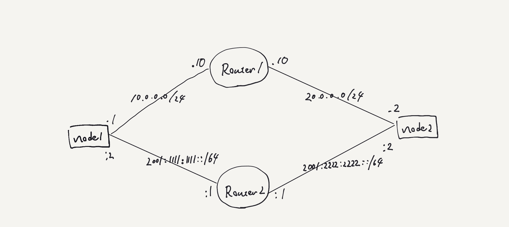

## Topology



## Host Requirement

none

## RUN

```shell
$ docker-compose up -d
$ docker-compose exec node1 ip a                                                         
$ docker-compose exec node1 ip route
$ docker-compose exec node1 ip -6 route
$ docker-compose exec node1 ip -6 route del default # gatewayが勝手に設定されるので消す
$ docker-compose exec node2 ip a                                                         
$ docker-compose exec node2 ip route
$ docker-compose exec node2 ip -6 route
$ docker-compose exec node1 ip -6 route del default # gatewayが勝手に設定されるので消す

$ docker-compose exec node1 ip route add 20.0.0.0/24 via 10.0.0.10 via eth1
$ docker-compose exec node1 ip -6 route add 2001:2222:2222::/64 via 2001:1111:1111::10 dev eth0
$ docker-compose exec node1 ip route
$ docker-compose exec node1 ip -6 route
$ docker-compose exec node2 ip route add 10.0.0.0/24 via 20.0.0.10 dev eth1
$ docker-compose exec node2 ip -6 route add 2001:1111:1111::/64 via 2001:2222:2222::10 dev eth0 
$ docker-compose exec node2 ip route
$ docker-compose exec node2 ip -6 route
$ docker-compose exec node1 ping 20.0.0.2
$ docker-compose exec node1 ping6 2001:2222:2222::2 
```

## Knowledge

* `networks`にIPレンジを定義、各コンテナの`networks`でIP指定ができる。  
  ipv6を利用する場合はsysctlsで`net.ipv6.conf.all.disable_ipv6=0`と`net.ipv6.conf.default.disable_ipv6=0`が必要
  ```
  version: '3.9'
  services:
    router1:
      build: Ubuntu18.04
      tty: true
      privileged: true
      networks:
        ipv4_nw1:
          ipv4_address: 10.0.0.10
        ipv6_nw1:
          ipv6_address: 2001:1111:1111::1
      sysctls:
        - net.ipv4.conf.all.forwarding=1
        - net.ipv4.conf.all.rp_filter=0
        - net.ipv6.conf.all.forwarding=1
        - net.ipv6.conf.all.disable_ipv6=0
        - net.ipv6.conf.all.seg6_enabled=1
        - net.ipv4.conf.default.forwarding=1
        - net.ipv4.conf.default.rp_filter=0
        - net.ipv6.conf.default.forwarding=1
        - net.ipv6.conf.default.disable_ipv6=0
        - net.ipv6.conf.default.seg6_enabled=1
  networks:
    ipv4_nw1:
      ipam:
        driver: default
        config:
          - subnet: "10.0.0.0/24"
    ipv6_nw1:
      ipam:
        driver: default
        config:
          - subnet: "2001:1111:1111::/64"
  ```

* dockerで作成するネットワークはipv4/ipv6ともに`(prefix).1`および`(prefix)::1`は予約IP

* `enable_ipv6`はdocker-compose verison3より不要  
  <https://docs.docker.com/compose/compose-file/compose-file-v3/#enable_ipv6>

* コンテナのipコマンドを叩く場合には下記いずれかが必要  
  1. `privileged: true`を各コンテナに付与する
  2. `cap_drop:  - NET_ADMIN`を各コンテナに付与する

## Links

* Docker composeのネットワーク設定
  * [Networking in Compose | Docker Documentation](https://docs.docker.com/compose/networking/)
  * [Compose file version 3 reference #networks| Docker Documentation](https://docs.docker.com/compose/compose-file/compose-file-v3/#networks)
  * [network コマンドを使う Docker-docs-ja 19.03 ドキュメント](http://docs.docker.jp/v19.03/engine/userguide/networking/work-with-networks.html)
  * <https://github.com/haugene/docker-transmission-openvpn/issues/1541#issuecomment-731770864>